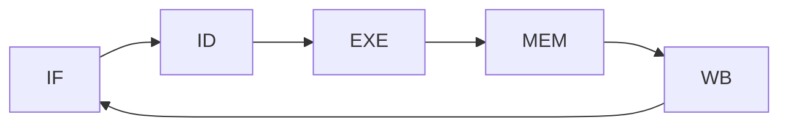
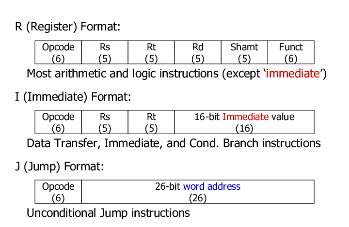
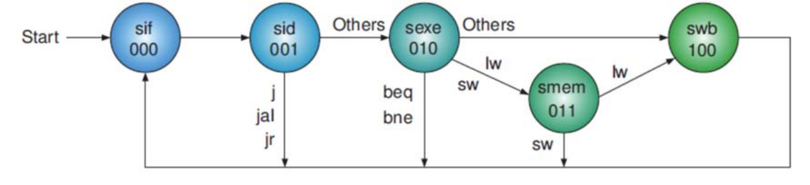
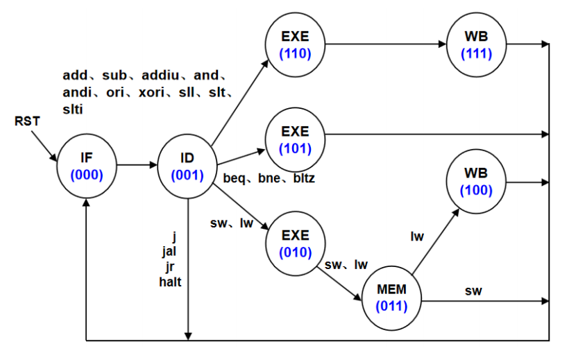
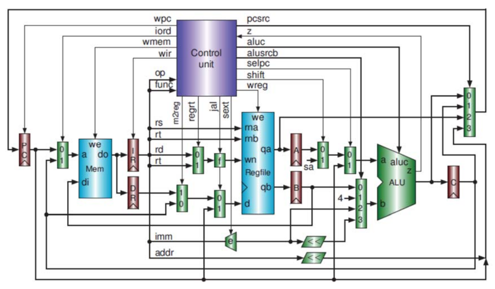
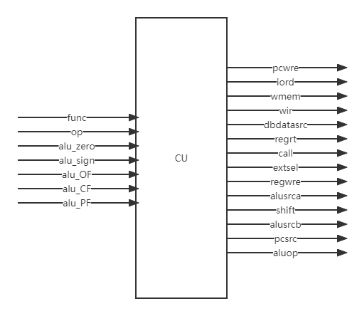
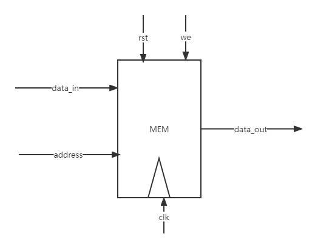
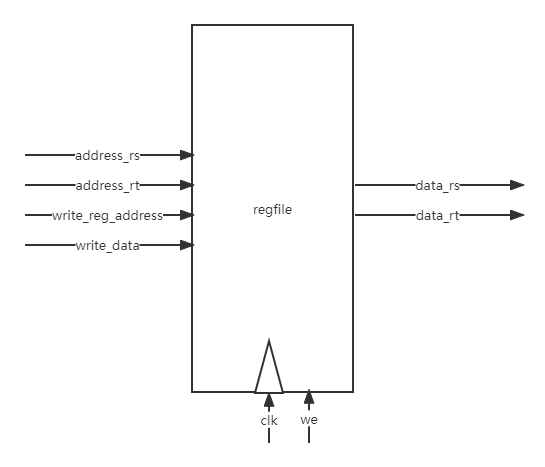
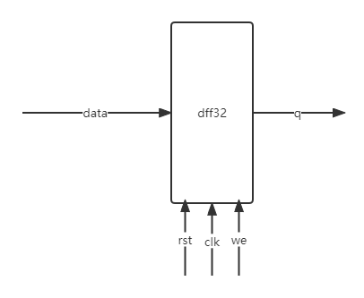
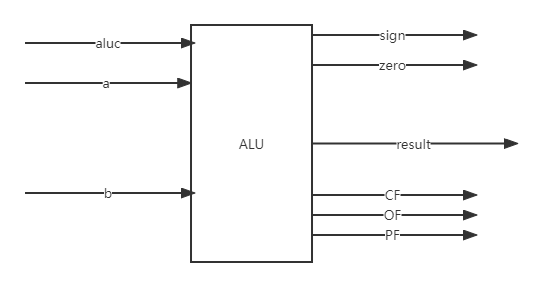

# MIPS-CPU

## 多周期

### 取指 IF

根据PC从存储器取出指令，如果是地址转移指令，则将转移地址送入PC，否则PC := PC + 4。

### 译码 ID

对取值操作中得到的指令进行译码，确定这条指令需要完成的操作从而产生相应的错做控制信号，用于驱动执行状态中的各种操作。

### 执行 EXE

根据指令译码得到的操作控制信号，具体地执行指令动作，然后转移到结果写回状态。

### 访存 MEM

所有需要访问存储器的操作都将在这个步骤中执行，该步骤给出存储器的数据地址，把数据写入到存储器中数据地址所指定的存储单元或者从存储器中得到数据地址单元中的数据。

### 回写 WB

指令执行的结果或者访问存储器中得到的数据写回相应的目的寄存
器中。

## MIPS指令

opcode：为操作码；
rs：为第 1 个源操作数寄存器，寄存器地址（编号）是 00000\~11111，00~1F；
rt：为第 2 个源操作数寄存器，或目的操作数寄存器，寄存器地址（同上）；
rd：为目的操作数寄存器，寄存器地址（同上）；
sa：为位移量（shift amt），移位指令用于指定移多少位；
funct：为功能码，在寄存器类型指令中（R 类型）用来指定指令的功能；immediate：为 16 位立即数，用作无符号的逻辑操作数、有符号的算术操作数、数据加载（Load）/数据保存（Store）指令的数据地址字节偏移量和分支指令中相对程序计数器（PC）的有符号偏移量；
 address：为地址。

## 控制信号

### 状态机

20指令状态机如下图所示：

为方便操作，添加更多的指令，将exe拆分成3个状态

状态的转移有的是无条件的，例如从 sIF 状态转移到 sID 就是无条件的；有些是有条件的，例如 sEXE 状态之后不止一个状态，到底转向哪个状态由该指令功能，即指令操作码决定。每个状态代表一个时钟周期。

## 数据通路

是一个简单的基本上能够在多周期 CPU 上完成所要求设计的指令功能的数据通路和必要的控制线路图。访问存储器时，先给出内存地址，然后由读或写信号控制操作。对于寄存器组，给出寄存器地址（编号），读操作时不需要时钟信号，输出端就直接输出相应数据；而在写操作时，在 WE 使能信号为 1 时，在时钟边沿触发将数据写入寄存器。

## 控制单元

控制单元信号及其含义如下：

|   控制信号   |                              0                               |                              1                               |
| :----------: | :----------------------------------------------------------: | :----------------------------------------------------------: |
|     RST      |                            复位PC                            |                        接收下一条地址                        |
|    PCWre     |                           PC不更改                           |                            PC更改                            |
|   ALUsrcA    | 来自寄存器堆data1输出，相关指令：add、sub、addiu、and、andi、ori、xori、slt、slti、sw、lw、beq、bne、bltz | 来自移位数sa，进行(zero-extend)sa，即 {{27{1'b0},sa}，相关指令：sll |
|   ALUsrcB    | 来自寄存器堆data2输出，相关指令：add、sub、and、slt、sll、beq、bne、bltz | 来自sing或zero扩展的立即数，相关指令：addiu、andi、ori、xori、slti、lw、sw |
|  DBDataSrc   | 来自ALU运算结果，相关指令：add、sub、addiu、and、andi、ori、xori、sll、slt、slti |                来自数据Data MEM，相关指令：lw                |
|    RegWre    | 无写寄存器组寄存器，相关指令：beq、bne、bltz、j、sw、jr、halt | 寄存器组写使能，相关指令：add、sub、addiu、and、andi、ori、xori、sll、slt、slti、lw、jal |
|  WrRegDSrc   |    写入寄存器组寄存器的数据来自pc4，相关指令：jal，写$31     | 写入寄存器组寄存器的数据来自ALU运算结果或存储器读出的数据，相关指令：add、addiu、sub、and、andi、ori、xori、sll、slt、slti、lw |
|   InsMemRW   |                         写指令存储器                         |                         读指令存储器                         |
|     mRD      |                       存储器输出高阻态                       |                       读数据存储器，lw                       |
|     mWR      |                            无操作                            |                       写数据存储器，sw                       |
|    IRWre     |                           IR不更改                           | IR 寄存器写使能。向指令存储器发出读指令代码后，这个信号也接着发出，在时钟上升沿，IR 接收从指令存储器送来的指令代码。与每条指令都相关。 |
|    ExtSel    |     (zero-extend)immediate，相关指令：andi、xori、ori；      | (sign-extend)immediate，相关指令：addiu、slti、lw、sw、beq、bne、bltz； |
| PCSrc[1..0]  | 00：pc<－pc+4，相关指令：add、addiu、sub、and、andi、ori、xori、slt、slti、sll、sw、lw、beq(zero=0)、bne(zero=1)、bltz(sign=0)； 01：pc<－pc+4+(sign-extend)immediate ×4，相关指令：beq(zero=1)、 bne(zero=0)、bltz(sign=1)； | 10：pc<－rs，相关指令：jr  11：pc<－{pc[31:28],addr[27:2],2'b00}，相关指令：j、jal； |
| RegDst[1..0] | 写寄存器组寄存器的地址，来自： 00：0x1F($31)，相关指令：jal，用于保存返回地址（$31<-pc+4）； 01：rt 字段，相关指令：addiu、andi、ori、xori、slti、lw； | 10：rd 字段，相关指令：add、sub、and、slt、sll； 11：未用； |
| ALUOp[2..0]  |           ALU 8 种运算功能选择(000-111)，看功能表            |                                                              |

下图为控制单元示意图：

## 存储器

data_in: 存储器数据输入端口

data_out: 存储器数据输出端口

clk: 时钟

rst: 复位

we: 写使能 0 写

## 寄存器组

 Read Reg1，rs 寄存器地址输入端口
 Read Reg2，rt 寄存器地址输入端口
 Write Reg，将数据写入的寄存器，其地址输入端口（rt、rd）
 Write Data，写入寄存器的数据输入端口
 Read Data1，rs 寄存器数据输出端口
 Read Data2，rt 寄存器数据输出端口
 WE，写使能信号，为 1 时，在时钟边沿触发写入

## 指令寄存器

存放正在执行的指令代码

## 算术逻辑单元

 result，ALU 运算结果
 zero，运算结果标志，结果为 0，则 zero=1；否则 zero=0
 sign，运算结果标志，结果最高位为 0，则 sign=0，正数；否则，sign=1，负数

ALU运算表如下：

